# ABC Hub Modern Data Platform

**From streaming and rental records to customer, content, and inventory analytics.**

[Setup guide](docs/setup_notes.md) · [SQL execution order](sql/README.md) · [NiFi flow](nifi/ABC_HUB_ETL.json) · [Architecture](#3-architecture) · [Data models](#6-data-models) · [Pipeline screenshots](#7-etl-flow) · [Project report](docs/Final_Report.pdf)

## 1. Project Overview

A data engineering learning project built with **Apache NiFi and PostgreSQL**. It brings digital streaming and physical rental data through three warehouse layers: Bronze ingestion, Silver Data Vault, and Gold Kimball models.

| Source data | Warehouse | Analytical outputs |
| --- | --- | --- |
| 26 operational tables | 54 tables across 3 layers | 3 fact tables |
| 99 anonymized sample rows | 2 PostgreSQL databases | Customer, content, and inventory analysis |

The repository includes SQL, an importable NiFi flow, Docker configuration, sample CSVs, diagrams, and the final report.

## 2. Business Problem

Streaming, rentals, subscriptions, payments, and support each capture part of ABC Hub's activity. Combining them helps answer:

- **Customers:** How do engagement, rental activity, and spending change each day?
- **Content:** Which titles attract streams, rentals, revenue, and positive ratings?
- **Inventory:** How much is each physical item used, and where is capacity available?

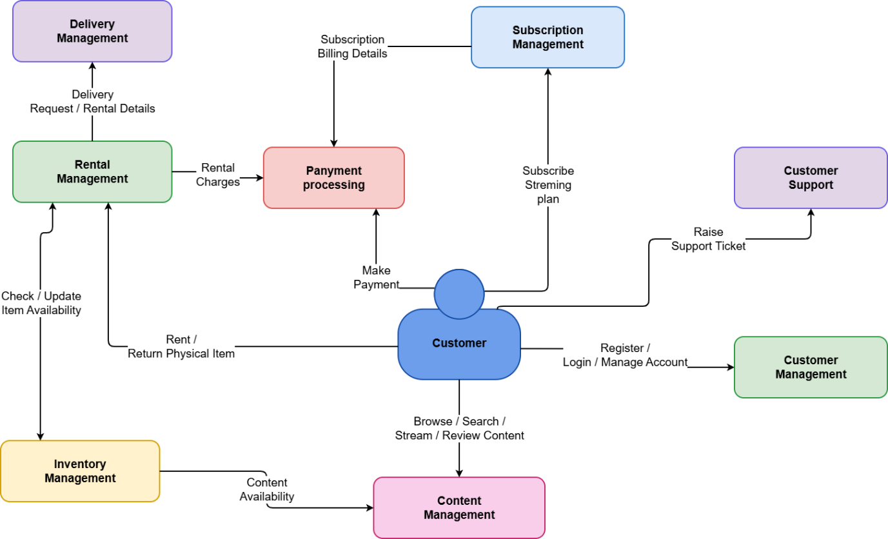

*Source systems behind streaming, subscriptions, rentals, and customer support.*

## 3. Architecture

**Operational PostgreSQL → NiFi → Bronze → Silver Data Vault → Gold Kimball**

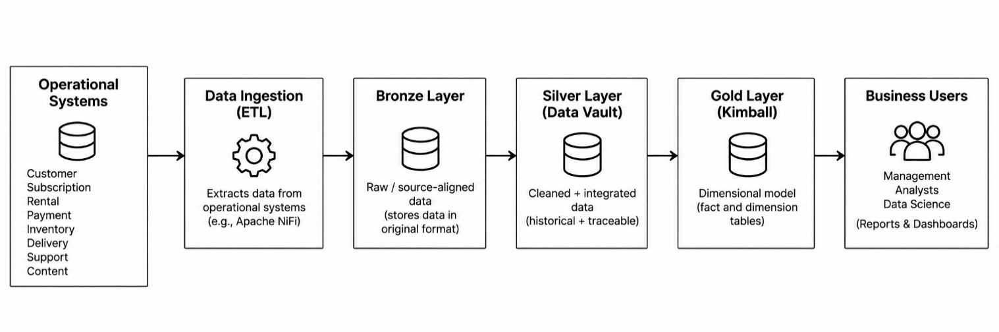

*Platform design from operational sources through the warehouse to analytical use cases.*

`abc_hub_operational` stores source records. `abc_hub_analytics` contains the `bronze`, `silver`, and `gold` schemas. Some Gold transformations also read Bronze directly.

## 4. Tech Stack

| Technology | Role |
| --- | --- |
| Apache NiFi 2.10.0 | Visual ETL flows and database transfers |
| PostgreSQL + SQL | Operational storage, warehouse models, and validation |
| Docker / Compose | Run NiFi and optional PostgreSQL locally |
| PostgreSQL JDBC 42.7.12 | NiFi database connectivity; included in the Docker image |
| Data Vault + Kimball | Integrated business history and dimensional analytics |

## 5. Data Pipeline

### 5.1 Bronze Layer

**26 source-aligned tables** retain operational identifiers and ingestion metadata, giving downstream transformations a traceable source layer.

### 5.2 Silver Data Vault

**6 hubs, 4 links, and 5 satellites** separate business identities, relationships, and descriptive history. Hubs cover customer, content, rental, inventory, subscription, and payment.

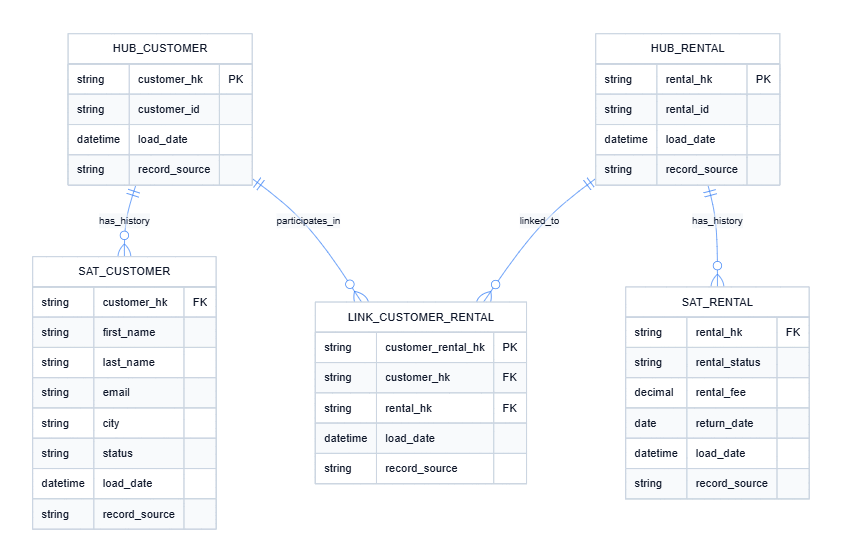

*Business identities, their relationships, and descriptive history in Silver.*

### 5.3 Gold Kimball Layer

**10 dimensions and 3 facts** organize measures around customer, content, inventory, location, and time, making analytical queries easier to write.

## 6. Data Models

### 6.1 Customer Daily Activity

**Grain: one customer per day.** Measures streaming sessions and duration, rentals, returns, spending, and support tickets.

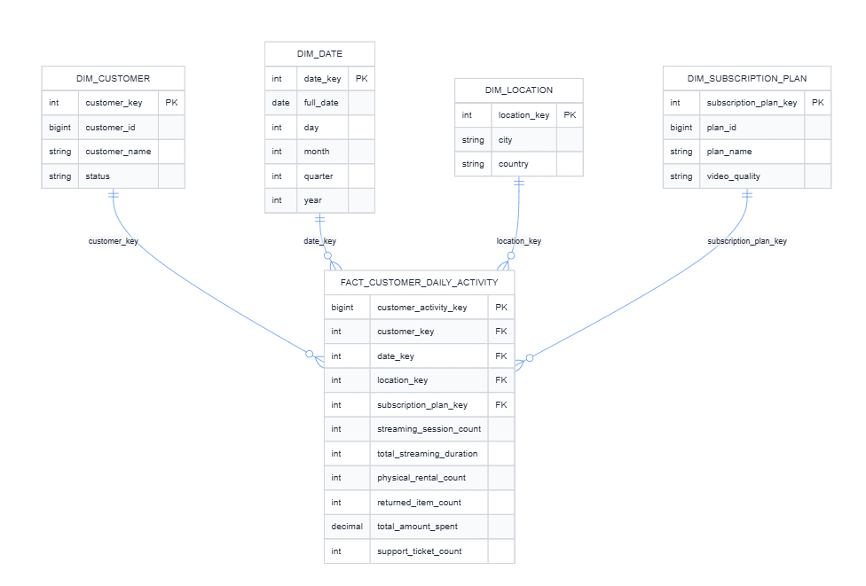

*Daily customer measures connected to customer, date, location, and subscription plan dimensions.*

### 6.2 Content Monthly Performance

**Grain: one content item per month.** Measures streams, rentals, revenue, average ratings, and wishlist additions.

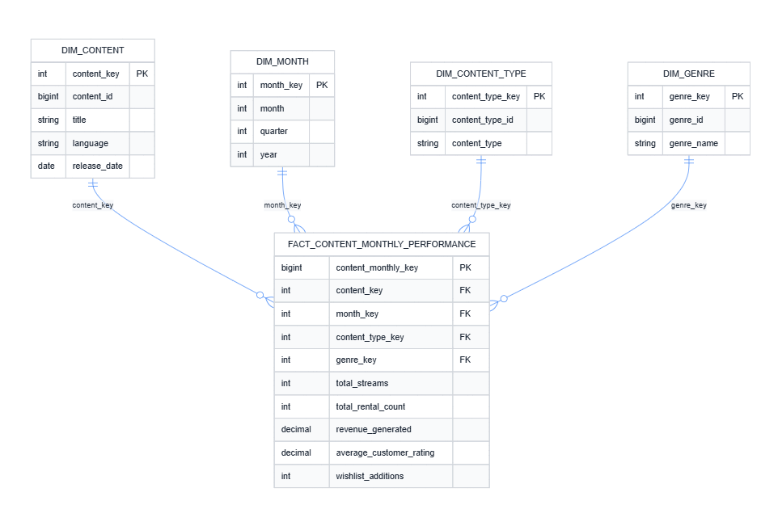

*Monthly content measures connected to content, month, content type, and genre dimensions.*

### 6.3 Inventory Daily Utilisation

**Grain: one inventory item per day.** Measures rentals, returns, availability, and utilisation, with content and warehouse context.

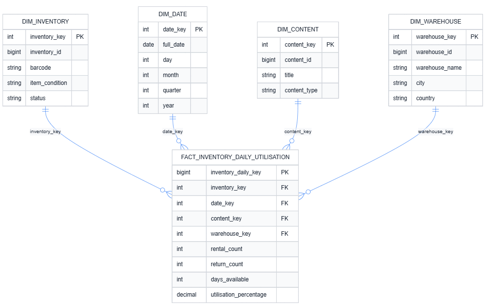

*Daily inventory measures connected to inventory, date, content, and warehouse dimensions.*

## 7. ETL Flow

Import [ABC_HUB_ETL.json](nifi/ABC_HUB_ETL.json) to access the complete NiFi process group.

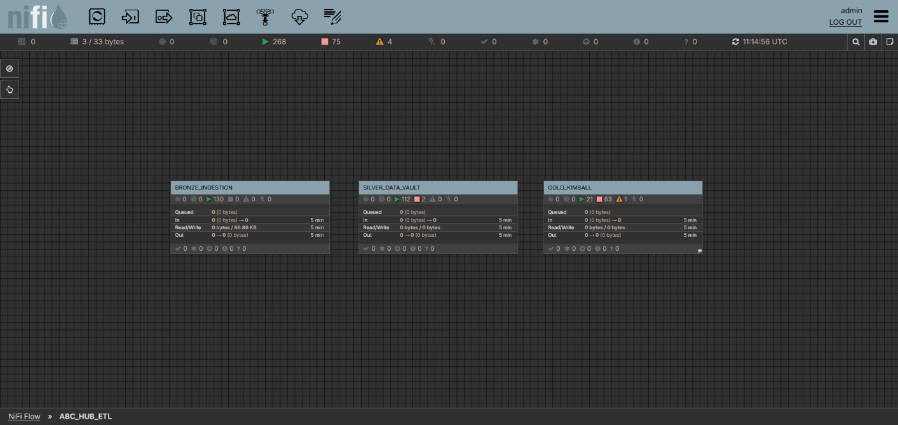

*Overall NiFi process group, followed by the three layer views below. Screenshots are from the final report.*

### 7.1 Bronze Ingestion

Reads operational tables and writes source records to Bronze. Check ingestion results before continuing.

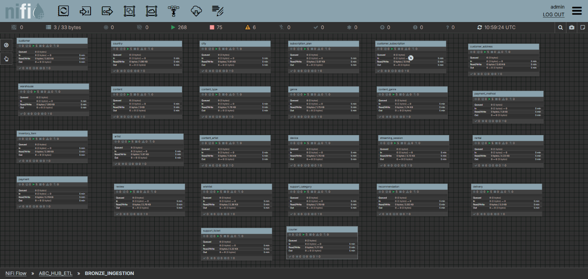

*Operational-to-Bronze ingestion flow captured in the project report.*

### 7.2 Silver Core and Links

Run `CORE_TRIGGER` for hubs and satellites, then `LINK_TRIGGER` after hub keys exist.

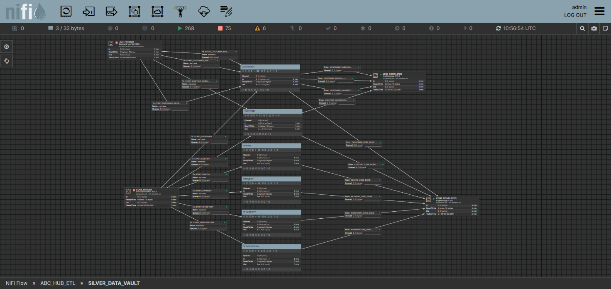

*Separate Core and Link stages organize the Data Vault loads.*

### 7.3 Gold Dimensions and Facts

Run `DIMENSION_TRIGGER` first, then `FACT_TRIGGER` after dimension keys are available.

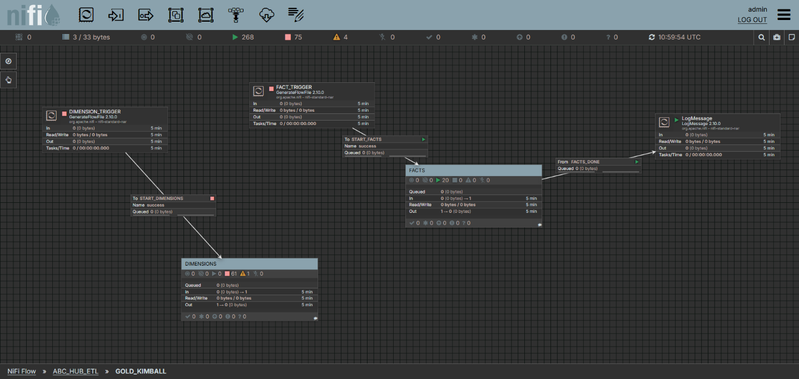

*Separate Dimension and Fact stages organize the dimensional loads.*

## 8. Execution Results

The execution screenshots verify populated Gold tables and returned analytical query results. They provide evidence of these outputs, without establishing full automated pipeline validation or source-to-target reconciliation.

### Gold Layer Row Counts

The captured counts show that the following Gold-layer tables were successfully populated. These are counts from the captured execution, not expected results for the repository's reduced sample dataset.

| Gold table | Row count |
| --- | ---: |
| `dim_customer` | 1,008 |
| `dim_content` | 600 |
| `dim_inventory` | 1,785 |
| `fact_customer_daily_activity` | 58,480 |
| `fact_content_monthly_performance` | 7,099 |
| `fact_inventory_daily_utilisation` | 2,806,545 |

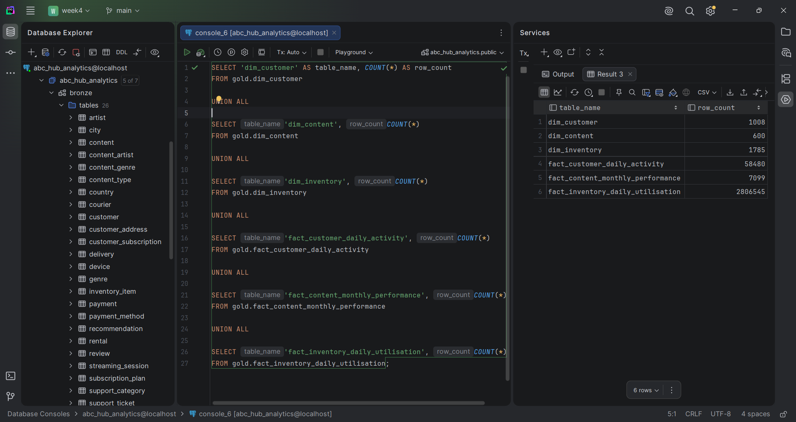

*Row counts for three Gold dimensions and all three fact tables.*

### Populated Fact Table

`gold.fact_customer_daily_activity` contains populated analytical rows. The screenshot shows 20 returned rows, including customer, date, and location keys, from this query:

```sql
SELECT *
FROM gold.fact_customer_daily_activity
LIMIT 20;
```

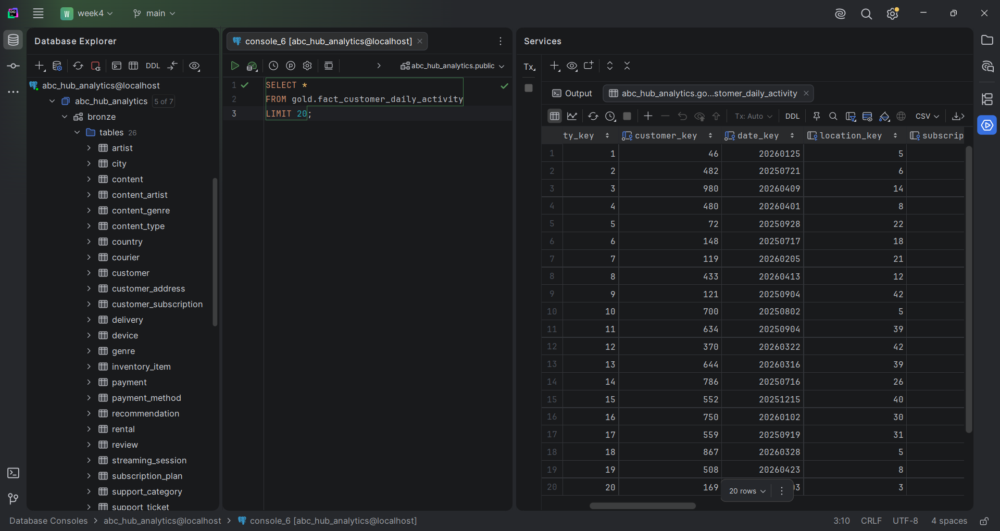

*Sample records returned from the customer daily activity fact table.*

### Sample Analytical Query

The Gold dimensional model supports analytical queries by joining facts with dimensions. This query joins `gold.fact_content_monthly_performance` with `gold.dim_content` and returns content titles and monthly measures, ordered by `total_streams` descending:

```sql
SELECT
    c.title,
    f.month_key,
    f.total_streams,
    f.total_rental_count,
    f.revenue_generated,
    f.average_customer_rating,
    f.wishlist_additions
FROM gold.fact_content_monthly_performance f
JOIN gold.dim_content c ON f.content_key = c.content_key
ORDER BY f.total_streams DESC
LIMIT 10;
```

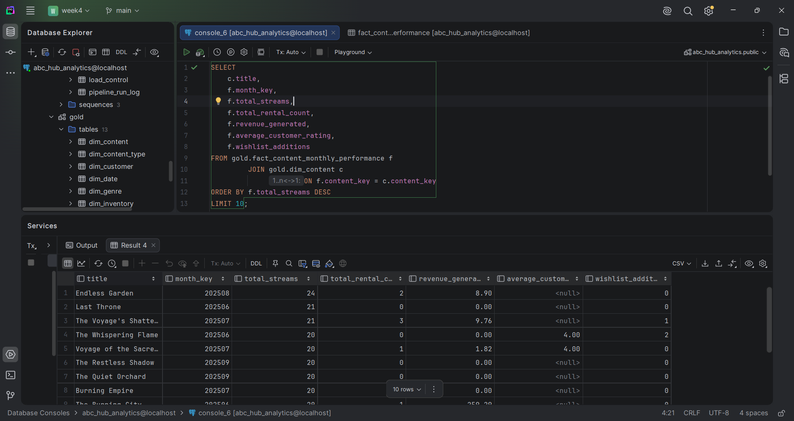

*Returned content performance results, including streams, rentals, revenue, ratings, and wishlist additions.*

## 9. Project Structure

```text
abc-hub-modern-data-platform/
|-- data/                         # 26 sample CSVs
|-- docs/
|   |-- setup_notes.md            # Docker, JDBC, databases, CSV loading
|   |-- Final_Report.pdf          # Final project report
|   |-- operational_er_diagram.pdf
|   |-- diagrams/                 # Architecture and data models
|   |-- pipeline/                 # NiFi screenshots
|   `-- results/                  # Execution evidence
|       |-- gold_table_counts.png
|       |-- populated_fact_table.png
|       `-- sample_query_result.png
|-- nifi/ABC_HUB_ETL.json          # Importable ETL flow
|-- sql/                          # DDL, validation, and execution guide
|   `-- create_databases.sql       # Fresh database creation
|-- Dockerfile                    # NiFi with PostgreSQL JDBC
|-- compose.yaml                  # Local NiFi and PostgreSQL services
`-- README.md
```

## 10. How to Run

1. **Start the services:** follow the [setup guide](docs/setup_notes.md) for Docker and local configuration.
2. **Prepare the databases:** create operational tables, load CSVs with `\copy`, and follow the [SQL execution order](sql/README.md) for warehouse tables.
3. **Configure NiFi:** import the flow and enable the database connection pools and record services.
4. **Run ETL in order:** Bronze → Silver Core → Silver Links → Gold Dimensions → Gold Facts. Verify each stage before starting the next.
5. **Validate:** run [validation_queries.sql](sql/validation_queries.sql) against `abc_hub_analytics`; review row counts, duplicate keys, missing relationships, and fact grains.

**Verified so far:** the documented sample import loaded 99 rows across 26 source tables, and the warehouse scripts created 54 tables in an isolated PostgreSQL container. The [execution screenshots](#8-execution-results) additionally show populated Gold tables and a fact-to-dimension analytical query returning results.

## 11. Key Engineering Decisions

- **Separate databases** keep operational records apart from analytical transformations.
- **Three warehouse layers** support source traceability, business integration, and dimensional reporting.
- **NiFi with a bundled JDBC driver** makes the local runtime easier to reproduce; database setup and CSV loading remain manual.
- **Small, related samples** make the project easier to try while keeping the full course dataset outside the repository.

## 12. Assumptions

The implementation was developed using the following assumptions:

- Daily refresh is sufficient for the analytical reporting requirements.
- Bronze data represents source-aligned operational records with ingestion metadata.
- Silver Hubs and Satellites are loaded before Links so that the required business keys exist.
- Gold Dimensions are loaded before Fact tables so that dimension keys are available when facts are created.
- Historical records are retained in the Silver Data Vault layer rather than overwriting previous descriptive values.
- The Gold layer is designed primarily for analytical reporting rather than operational transactions.
- Where multiple genres are associated with the same content, a deterministic genre is selected for the current dimensional model.
- The repository contains reduced sample datasets for reproducibility; the full assignment dataset can be loaded using the same pipeline.

## 13. Known Limitations

- Complete change capture, safe repeated loads, and automatic stage coordination are not implemented. Independent triggers require controlled execution.
- Date/month generation covers **2020–2030**; persisted ETL monitoring is not implemented.
- Execution screenshots verify populated Gold tables and returned sample analytical query results. Full automated end-to-end validation and source-to-target reconciliation are not established by this evidence.
- Validation reports issues without automatically failing on findings. Report diagrams may differ from the implemented SQL.

## 14. Future Improvements

Reliable incremental loads and retries · Stage coordination · Automated quality checks · ETL monitoring · BI dashboards

## 15. Project Report

The [final project report (PDF)](docs/Final_Report.pdf) documents the design and implementation. Explore the [operational ER diagram](docs/operational_er_diagram.pdf) and the pipeline screenshots linked above for supporting detail.
